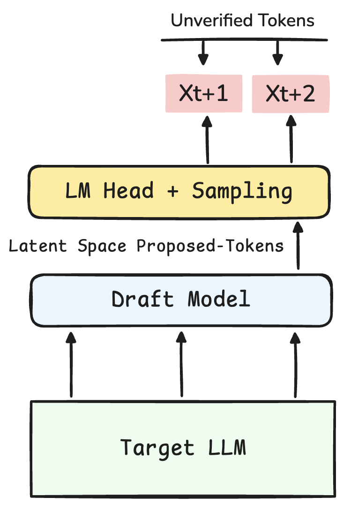
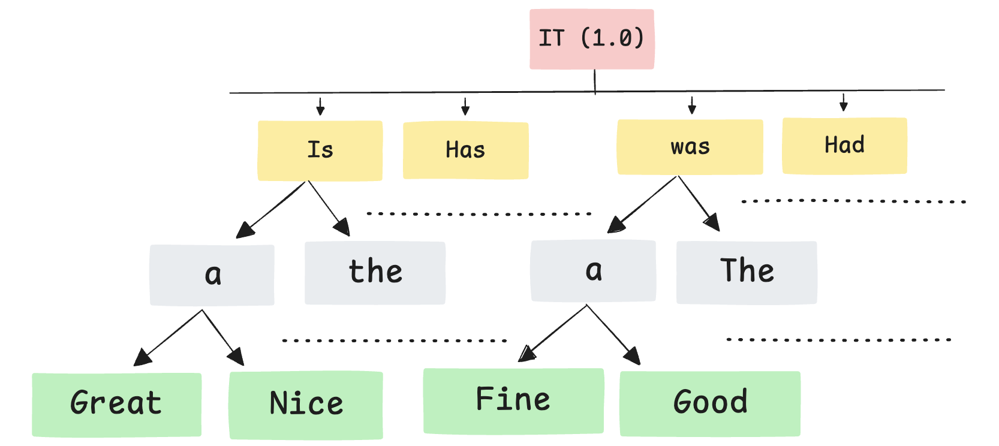
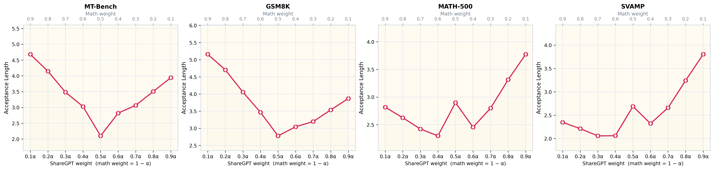
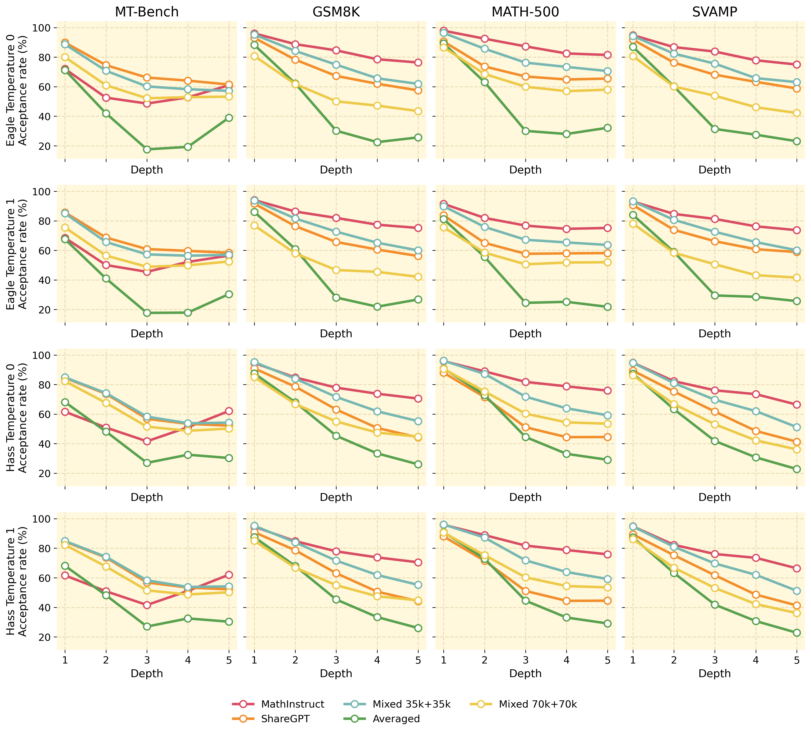
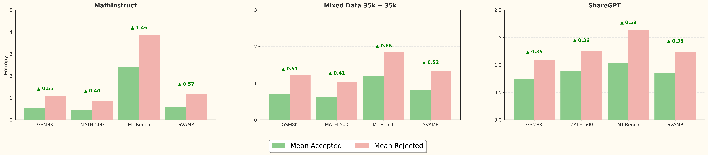

# TAPS: Task-Aware Proposal Distributions for Speculative Sampling

**Project Page · March 2026**

Mohamad Zbib, Mohamad Bazzi, Ammar Mohanna, **Bernard Ghanem**\*, **Hasan Abed Al Kader Hammoud**\*  (\*equal advising)  
KAUST · AUB — Contacts: [mbz02@mail.aub.edu](mailto:mbz02@mail.aub.edu), [hasanabedalkader.hammoud@kaust.edu.sa](mailto:hasanabedalkader.hammoud@kaust.edu.sa)

---

> ⚡ Task-aware drafts that speed up speculative decoding without sacrificing quality.

## Quick links
[](https://huggingface.co/collections/zbeeb/taps)
[](https://huggingface.co/datasets/zbeeb/TAPS-Datasets)

## Contents
- [Overview](#-overview)
- [Abstract](#abstract)
- [Highlights](#-highlights)
- [Figures](#figures)
- [Results snapshot](#results-snapshot)
- [Repository map](#-repository-map)
- [Setup](#setup)
- [Citation](#citation)
- [License](#license)

---

## 🚀 Overview
TAPS studies how the draft training distribution shapes speculative decoding quality. Using Meta-Llama-3-8B-Instruct as the verifier and lightweight LLaMA-style drafters (HASS and EAGLE-2, ~0.8B params, shared tokenizer), the work compares single-domain training, mixed-domain training, and inference-time composition (confidence routing, merged-tree verification).

### TL;DR (At a glance)
- 🎯 Goal: Quantify how draft training data and specialist composition affect speculative decoding.
- 🧠 Verifier: Meta-Llama-3-8B-Instruct.
- ✏️ Drafts: HASS and EAGLE-2 (single-layer, ~0.8B params, shared tokenizer).
- 🧪 Workloads: MT-Bench (chat), GSM8K, MATH-500, SVAMP (reasoning).
- 📏 Metric: acceptance length (lossless speculative decoding).
- 🖥️ Compute: single node, 4×A100.

## Abstract
> Speculative decoding speeds up autoregressive generation by letting a lightweight drafter propose tokens that a larger verifier checks in parallel. We study how much draft quality depends on the training distribution using HASS and EAGLE-2 drafts trained on MathInstruct, ShareGPT, and mixed variants, evaluated on MT-Bench, GSM8K, MATH-500, and SVAMP. Task-matched drafts specialize; mixed data aids robustness but is not uniformly dominant across temperatures. Among composition strategies, weight averaging underperforms, confidence routing improves, and merged-tree verification attains the highest acceptance length. Confidence is a stronger routing signal than entropy. Results show speculative decoding quality hinges on both draft architecture and the alignment between draft training data and downstream workload.

## ✨ Highlights
- **Task-aware specialization:** ShareGPT drafts lead MT-Bench (e.g., HASS 3.98 vs. 2.90 for MathInstruct), while MathInstruct drafts dominate GSM8K/MATH-500/SVAMP.
- **Mixed data is nuanced:** Mixed 70k+70k (HASS) peaks at temperature 0 with average acceptance length 5.18 but drops at temperature 1 (3.69), where Mixed 35k+35k is steadier.
- **Composition wins:** Weight-space averaging is weakest (≈2.4–2.6). Confidence routing reaches ~4.8 average acceptance length; merged-tree verification is strongest (HASS 5.11, EAGLE-2 5.02 at temperature 0).
- **Routing signal:** Confidence cleanly separates workloads (MathInstruct chosen for 90.8% of GSM8K; ShareGPT for 81.2% of MT-Bench). Entropy is diagnostic but weaker for routing.

## Figures
<table>
  <tr>
    <td align="center">
      
    </td>
    <td align="center">
      
    </td>
  </tr>
  <tr>
    <td align="center"><em>Speculative decoding pipeline.</em></td>
    <td align="center"><em>Merged-tree verification packs MathInstruct and ShareGPT trees for one-pass verification.</em></td>
  </tr>
</table>

<p align="center">
  
  <br>
  <em>Checkpoint averaging is unstable across interpolation weights and remains weaker than inference-time composition (source: 5434×1294 px).</em>
</p>

<table>
  <tr>
    <td align="center">
      
    </td>
    <td align="center">
      
    </td>
  </tr>
  <tr>
    <td align="center"><em>Acceptance declines with depth but specialization persists (source: 4046×3665 px).</em></td>
    <td align="center"><em>Rejected tokens show higher entropy; confidence remains the stronger routing signal (source: 7059×1554 px).</em></td>
  </tr>
</table>

## 📊 Main results (acceptance length)
Benchmarks: MT-Bench (chat), GSM8K, MATH-500, SVAMP. Metric: average acceptance length (higher is better) under lossless speculative decoding.

<details>
<summary><b>Temperature 0</b></summary>

| Model Variant | Method | MT-Bench | GSM8K | MATH-500 | SVAMP | Average |
| --- | --- | --- | --- | --- | --- | --- |
| MathInstruct | HASS | 2.90 | 5.02 | 5.35 | 3.13 | 4.10 |
| MathInstruct | EAGLE-2 | 2.54 | 5.04 | 5.28 | 4.81 | 4.42 |
| ShareGPT | HASS | 3.98 | 4.09 | 3.98 | 4.44 | 4.12 |
| ShareGPT | EAGLE-2 | 3.57 | 3.72 | 3.81 | 3.71 | 3.70 |
| Mixed 35k+35k | HASS | 3.92 | 4.77 | 5.02 | 4.15 | 4.47 |
| Mixed 35k+35k | EAGLE-2 | 3.37 | 4.12 | 4.44 | 4.16 | 4.02 |
| Mixed 70k+70k | HASS | 4.13 | 5.53 | 5.67 | 5.38 | 5.18 |
| Mixed 70k+70k | EAGLE-2 | 3.75 | 4.68 | 4.85 | 4.64 | 4.48 |
| Averaged | HASS | 2.29 | 2.80 | 3.12 | 2.13 | 2.59 |
| Averaged | EAGLE-2 | 2.07 | 2.53 | 2.57 | 2.50 | 2.42 |
| Confidence Routed | HASS | 3.93 | 5.01 | 5.37 | 4.89 | 4.80 |
| Confidence Routed | EAGLE-2 | 3.63 | 4.91 | 5.25 | 4.71 | 4.63 |
| Merged Trees | HASS | 4.05 | 5.42 | 5.65 | 5.31 | 5.11 |
| Merged Trees | EAGLE-2 | 3.93 | 5.32 | 5.63 | 5.25 | 5.02 |

</details>

<details>
<summary><b>Temperature 1</b></summary>

| Model Variant | Method | MT-Bench | GSM8K | MATH-500 | SVAMP | Average |
| --- | --- | --- | --- | --- | --- | --- |
| MathInstruct | HASS | 2.31 | 4.75 | 4.63 | 2.46 | 3.54 |
| MathInstruct | EAGLE-2 | 2.43 | 4.71 | 4.61 | 4.53 | 4.07 |
| ShareGPT | HASS | 3.50 | 4.03 | 3.61 | 3.95 | 3.77 |
| ShareGPT | EAGLE-2 | 3.38 | 3.72 | 3.43 | 3.65 | 3.54 |
| Mixed 35k+35k | HASS | 3.46 | 4.66 | 4.47 | 4.57 | 4.29 |
| Mixed 35k+35k | EAGLE-2 | 3.10 | 4.08 | 4.02 | 4.03 | 3.81 |
| Mixed 70k+70k | HASS | 3.17 | 4.16 | 3.42 | 4.01 | 3.69 |
| Mixed 70k+70k | EAGLE-2 | 2.99 | 3.76 | 3.20 | 3.08 | 3.26 |
| Averaged | HASS | 2.10 | 2.78 | 2.90 | 2.69 | 2.62 |
| Averaged | EAGLE-2 | 2.01 | 2.49 | 2.42 | 2.45 | 2.34 |
| Confidence Routed | HASS | 3.51 | 4.72 | 4.55 | 4.71 | 4.37 |
| Confidence Routed | EAGLE-2 | 3.36 | 4.65 | 4.62 | 4.46 | 4.27 |
| Merged Trees | HASS | 3.76 | 5.21 | 4.98 | 5.05 | 4.75 |
| Merged Trees | EAGLE-2 | 3.55 | 5.01 | 4.79 | 4.93 | 4.57 |

</details>

## 🗂️ Repository map
| Folder | What lives here |
| --- | --- |
| `Taps-draft1/` | Paper figures and assets |
| `Hass-Code/` | HASS draft training/eval scripts (feature build, training, routing, merged-tree) |
| `Eagle-Code/` | EAGLE-2/3 draft code, training configs, eval utilities, Gradio demo |
| `docs/` | Routing and merged-tree technical reports |

## Setup
- Python 3.10+; GPU memory sufficient for Meta-Llama-3-8B-Instruct plus draft checkpoints (paper used 4×A100).
- Prefer per-project virtualenvs to avoid dependency clashes.

HASS install:
```bash
python -m venv .venv && source .venv/bin/activate
pip install -r Hass-Code/requirements.txt
```

EAGLE install:
```bash
python -m venv .venv && source .venv/bin/activate
pip install -r Eagle-Code/requirements.txt
pip install -e Eagle-Code
```

Build the paper PDF (from `Taps-draft1/`):
```bash
latexmk -pdf -interaction=nonstopmode main.tex
```

## Citation
```bibtex
@article{zbib2026taps,
  title={TAPS: Task Aware Proposal Distributions for Speculative Sampling},
  author={Zbib, Mohamad and Bazzi, Mohamad and Mohanna, Ammar and Ghanem, Bernard and Hammoud, Hasan Abed Al Kader},
  year={2026},
  note={Technical report}
}
```

## License
- `Eagle-Code` is Apache 2.0 (see `Eagle-Code/LICENSE`).
- HASS scripts follow their upstream licenses; add a license file before redistribution.
